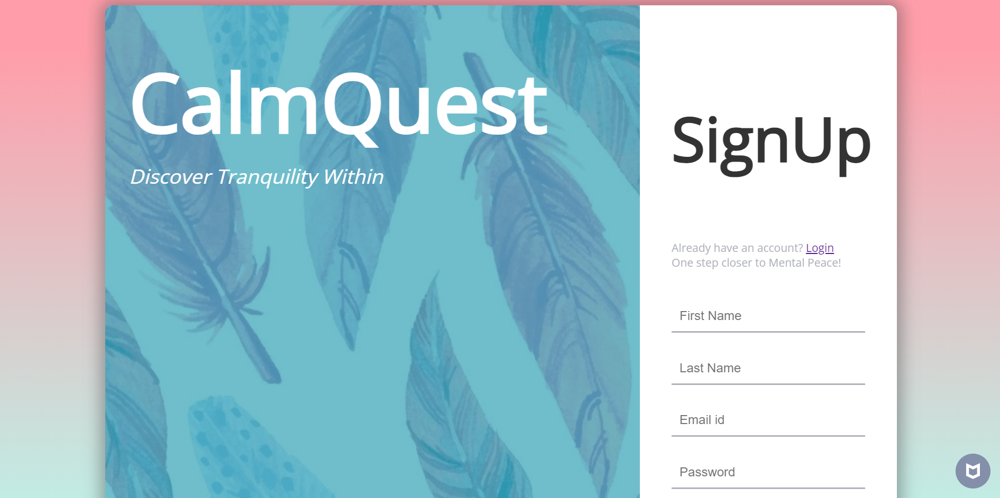

# CalmQuest

## Introduction <a name="introduction"></a>
Welcome to the CalmQuest! This application is designed to help you maintain a journal, practice meditation, and set and track your wellness goals. This README file will provide you with information on how to use the app, its features, and how to get started.

## Table of Contents

1. [Introduction](#introduction)
2. [Getting Started](#gettingStarted)
3. [Features](#features)
4. [Contributing](#contributing)


## Getting Started <a name="gettingStarted"></a>
To get started with the WebApp, follow these steps:

1. Clone the repository to your local machine:
   ```bash
   git clone https://github.com/Swasti-23/CalmQuest.git
2. Navigate to the project directory:
   ```bash
   cd CalmQuest
3. Install the required dependencies:
   ```bash
   npm install requirements.txt
4. Nagigate to the main directory:
   ```bash
   cd main
5. Start the application:
   ```bash
   npm run dev
   
The application will be accessible in your web browser at http://localhost:3000. You can now begin using the app to maintain a journal, set wellness goals, and use the meditation timer.



## Features <a name="features"></a>

### 1. Meditation Zone
The Meditation Zone allows you to meditate by setting time intervals, relaxing meditation sounds and breathing guide. 


### 2. Journal
The Journal feature allows you to create and maintain a digital journal. You can write and store your thoughts, ideas, and reflections.


### 3. Wellness Goals
The Wellness Goals feature allows you to set and track your wellness goals.


## Contributing <a name="contributing"></a>
We welcome contributions from the community to improve and enhance the WebApp. If you would like to contribute, please follow these steps:

Fork the repository.
1. Create a new branch for your feature or bug fix.
2. Make your changes and commit them.
3. Push your changes to your fork.
4. Create a pull request to the main repository.
   
Our team will review your pull request, and if accepted, your changes will be incorporated into the WebApp.


